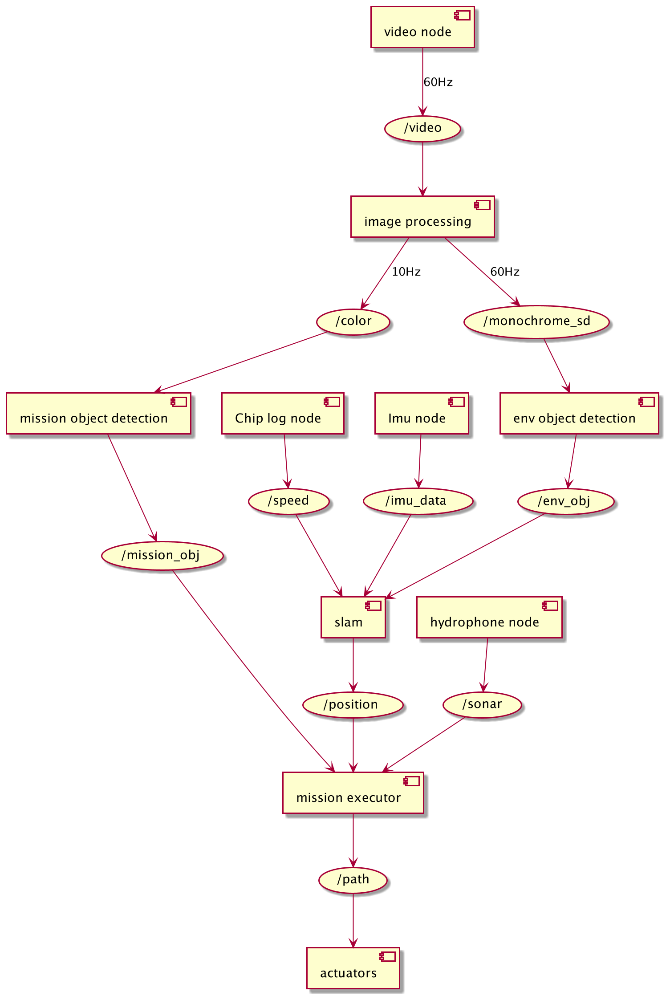

# Архитектура аппарата

# Описание архитектуры

Блок внешних сенсоров представляет собой набор камер, инерционных датчиков,
вертушечный лаг, каждый элемент в системе представляет собой узел, который
публикует данные в соответствующий ему топик, для видео потока добавлен узел
для предварительной обработки, улучшения качества изображения, настройки баланса
и масштабирования видео потока, этот узел публикует данные в два топика с разной частотой
черно-белые изображения с частотой работы камеры (60 герц), и цветные с частотой 10Hz
черно-белые изображения используются для поиска опорных точек в ноде "env object detection" 
эти данные в виде опорных точек используются узлом "slam" в месте с данными из топиков 
"imu_data" и "speed" для навигации, далее эти данные публикуются в топик 
"position" и используются узлом "mission executor" в месте с данными из топика "mission_obj"
для построения пути, эти данные публикуются в топик "path" и используется узлом "actuators"
для управления движителями и манипулятором
